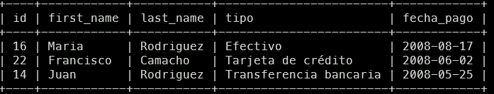
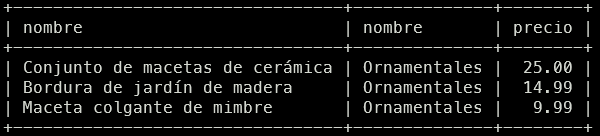
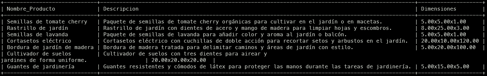

-- Definición de tablas
CREATE TABLE Pais(
    id INT PRIMARY KEY AUTO_INCREMENT,
    nombre VARCHAR(100),
    codigo VARCHAR(10)
);

CREATE TABLE Region (
    id INT PRIMARY KEY AUTO_INCREMENT,
    nombre VARCHAR(100),
    id_pais INT,
    FOREIGN KEY (id_pais) REFERENCES Pais(id)
);

CREATE TABLE Ciudad(
    id INT PRIMARY KEY AUTO_INCREMENT,
    nombre VARCHAR(100),
    codigo_postal VARCHAR(10),
    codigo_ciudad VARCHAR(10),
    region_id INT NOT NULL,
    FOREIGN KEY (region_id) REFERENCES Region(id)
);

CREATE TABLE Direccion(
    id INT PRIMARY KEY AUTO_INCREMENT,
    calle VARCHAR(30),
    calle_complemento VARCHAR(30),
    numero INT,
    ciudad_id INT NOT NULL,
    codigo_postal VARCHAR(10) NOT NULL,
    FOREIGN KEY (ciudad_id) REFERENCES Ciudad(id),
    UNIQUE (calle, calle_complemento, numero, ciudad_id)
);

CREATE TABLE Tercero (
    id INT PRIMARY KEY AUTO_INCREMENT,
    tipo ENUM('cliente', 'empresa', 'proveedor', 'otro') NOT NULL,
    first_name VARCHAR(50),
    last_name VARCHAR(50),
    email VARCHAR(100),
    UNIQUE (email)
);

CREATE TABLE Direccion_tercero(
    id INT PRIMARY KEY AUTO_INCREMENT,
    nombre_direccion VARCHAR(45),
    tercero_id INT(11) NOT NULL,
    direccion_id INT(11) NOT NULL,
    FOREIGN KEY (tercero_id) REFERENCES Tercero(id),
    FOREIGN KEY (direccion_id) REFERENCES Direccion(id)
);

CREATE TABLE Tercero_contacto (
    id INT PRIMARY KEY AUTO_INCREMENT,
    id_tercero INT,
    telefono VARCHAR(20),
    FOREIGN KEY (id_tercero) REFERENCES Tercero(id)
);

CREATE TABLE Contacto(
    id INT PRIMARY KEY AUTO_INCREMENT,
    tercero_id INT(11) NOT NULL,
    telefono_id INT(11) NOT NULL,
    FOREIGN KEY (tercero_id) REFERENCES Tercero(id),
    FOREIGN KEY (telefono_id) REFERENCES Telefono(id)
);

CREATE TABLE Empleado(
    id INT PRIMARY KEY AUTO_INCREMENT,
    tercero_id INT NOT NULL,
    rol_id INT NOT NULL,
    oficina_id INT NOT NULL,
    jefe_id INT,
    puesto VARCHAR(100) NULL,
    FOREIGN KEY (tercero_id) REFERENCES Tercero(id),
    FOREIGN KEY (rol_id) REFERENCES Rol(id),
    FOREIGN KEY (oficina_id) REFERENCES Oficina(id),
    FOREIGN KEY (jefe_id) REFERENCES Empleado(id)
);

CREATE TABLE Rol(
    id INT PRIMARY KEY AUTO_INCREMENT,
    rol VARCHAR(100) NOT NULL
);

CREATE TABLE Telefono(
    id INT PRIMARY KEY AUTO_INCREMENT,
    numero INT(20) NOT NULL,
    tipo_telefono INT(11) NOT NULL,
    FOREIGN KEY (tipo_telefono) REFERENCES Tipo_telefono(id)
);

CREATE TABLE Tipo_telefono(
    id INT PRIMARY KEY AUTO_INCREMENT,
    tipo VARCHAR(50) NOT NULL
);

CREATE TABLE Producto(
    id INT PRIMARY KEY AUTO_INCREMENT,
    ean VARCHAR(13),
    nombre VARCHAR(100),
    precio DECIMAL NOT NULL,
    tipo_gama_id INT(11) NOT NULL,
    descripcion VARCHAR(255),
    width DECIMAL NOT NULL,
    height DECIMAL NOT NULL,
    length DECIMAL NOT NULL,
    proveedor_id INT(11) NOT NULL,
    precio_proveedor DECIMAL(15,2) NOT NULL,
    FOREIGN KEY (tipo_gama_id) REFERENCES Gama_producto(id),
    FOREIGN KEY (proveedor_id) REFERENCES Proveedor(id_tercero),
    UNIQUE (ean)
);

CREATE TABLE Gama_producto(
    id INT PRIMARY KEY AUTO_INCREMENT,
    nombre VARCHAR(100),
    descripcion VARCHAR(255)
);

CREATE TABLE Forma_pago(
    id INT PRIMARY KEY AUTO_INCREMENT,
    tipo VARCHAR(50) NOT NULL,
    UNIQUE (tipo)
);

CREATE TABLE Tercero_forma_pago(
    id INT PRIMARY KEY AUTO_INCREMENT,
    tercero_id INT(11) NOT NULL,
    forma_pago_id INT(11) NOT NULL,
    FOREIGN KEY (tercero_id) REFERENCES Tercero(id),
    FOREIGN KEY (forma_pago_id) REFERENCES Forma_pago(id)
);

CREATE TABLE Pedido(
    id INT PRIMARY KEY AUTO_INCREMENT,
    fecha_pedido DATE NOT NULL,
    fecha_esperada DATE NOT NULL,
    fecha_entrega DATE NOT NULL,
    total DECIMAL NOT NULL,
    estado_pedido INT(11) NOT NULL,
    Tercero_forma_pago_id INT(11) NOT NULL DEFAULT 1,
    FOREIGN KEY (Tercero_forma_pago_id) REFERENCES Tercero_forma_pago(id),
    FOREIGN KEY (estado_pedido) REFERENCES Estado_pedido(id)
);

CREATE TABLE Estado_pedido(
    id INT PRIMARY KEY AUTO_INCREMENT,
    estado ENUM('pendiente', 'enviado', 'recibido') NOT NULL
);

CREATE TABLE Detalle_pedido(
    id INT PRIMARY KEY AUTO_INCREMENT,
    pedido_id INT(11) NOT NULL,
    producto_id INT(11) NOT NULL,
    cantidad INT(11) NOT NULL,
    precio DECIMAL NOT NULL,
    FOREIGN KEY (pedido_id) REFERENCES Pedido(id),
    FOREIGN KEY (producto_id) REFERENCES Producto(id)
);

CREATE TABLE Oficina(
    id INT PRIMARY KEY AUTO_INCREMENT,
    nombre VARCHAR(100),
    direccion_id INT(11) NOT NULL,
    ciudad_id INT(11) NOT NULL,
    telefono_id INT(11) NOT NULL,
    FOREIGN KEY (direccion_id) REFERENCES Direccion(id),
    FOREIGN KEY (ciudad_id) REFERENCES Ciudad(id),
    FOREIGN KEY (telefono_id) REFERENCES Telefono(id)
);

CREATE TABLE Oficina_stock(
    id INT PRIMARY KEY AUTO_INCREMENT,
    oficina_id INT(11) NOT NULL,
    producto_id INT(11) NOT NULL,
    cantidad INT(11) NOT NULL,
    FOREIGN KEY (oficina_id) REFERENCES Oficina(id),
    FOREIGN KEY (producto_id) REFERENCES Producto(id)
);

CREATE TABLE Cliente (
    id_tercero INT PRIMARY KEY, 
    preferencias VARCHAR(150), 
    FOREIGN KEY (id_tercero) REFERENCES Tercero (id)
);

CREATE TABLE Empresa (
    id_tercero INT PRIMARY KEY, 
    numero_registro VARCHAR(50), 
    FOREIGN KEY (id_tercero) REFERENCES Tercero (id)
);

CREATE TABLE Proveedor (
    id_tercero INT PRIMARY KEY, 
    tipo_servicio VARCHAR(100), 
    FOREIGN KEY (id_tercero) REFERENCES Tercero (id)
);


DATOS

INSERT INTO Ciudad
(`id`, `nombre`, `codigo_postal`, `codigo_ciudad`, `region_id`)
VALUES
(1, 'Los Angeles', '90001', 'LA', 1),
(2, 'San Francisco', '94102', 'SF', 1),
(3, 'Miami', '33101', 'MI', 2),
(4, 'Orlando', '32801', 'ORL', 2),
(5, 'Nueva York', '10001', 'NYC', 3),
(6, 'Madrid', '28001', 'MAD', 4),
(7, 'Barcelona', '08001', 'BCN', 5),
(8, 'Girona', '17001', 'GIR', 5),
(9, 'Tarragona', '43001', 'TGN', 5),
(10, 'Lleida', '25001', 'LLE', 5);


INSERT INTO `GARDEN_DATABASE`.`Cliente`
(`id_tercero`, `preferencias`)
VALUES
(1, 'Compra regular de productos para GoldFish'),
(3, 'Cliente frecuente de Gardening Associates'),
(4, 'Compra ocasional en Gerudo Valley'),
(5, 'Adquiere productos de jardinería en TendoGarden'),
(6, 'Compra principalmente en Lasas'),
(7, 'Frecuenta Beragua para sus compras'),
(8, 'Socio activo en ClubGolfPuertadelhierro'),
(9, 'Compra regular de productos Naturagua'),
(10, 'Cliente fiel de DaraDistribuciones'),
(11, 'Adquiere productos en Madrilenaderiegos'),
(13, 'Cliente habitual de CamunasJardinesSL'),
(14, 'Compra productos en DardenaSA'),
(15, 'Frecuenta JardindeFlores para sus compras'),
(16, 'Compra regularmente en FloresMarivi'),
(17, 'Adquiere productos en FlowersSA'),
(18, 'Compra principalmente en Naturajardin'),
(19, 'Cliente frecuente de GolfSA'),
(20, 'Compra productos en AmerichGolfManagementSL'),
(21, 'Cliente fiel de Aloha'),
(22, 'Compra en ElPrat para sus necesidades de jardinería'),
(23, 'Adquiere productos en Sotogrande'),
(24, 'Cliente habitual de ViveroHumanes'),
(25, 'Compra en FuenlaCity para sus proyectos de jardinería'),
(26, 'Frecuenta JardinesyMansionesCactusSL para sus compras'),
(27, 'Compra productos en JardineríasMatíasSL'),
(28, 'Cliente fiel de Agrojardin'),
(29, 'Compra regularmente en TopCampo'),
(30, 'Cliente frecuente de JardineriaSara'),
(31, 'Adquiere productos en Campohermoso'),
(35, 'Compra en TutifrutiSA para sus necesidades de jardinería'),
(36, 'Frecuenta FloresSL para sus compras'),
(37, 'Cliente habitual de TheMagicGarden'),
(38, 'Compra principalmente en ElJardinVivienteSL');

INSERT INTO `GARDEN_DATABASE`.`Empresa`
(`id_tercero`, `numero_registro`)
VALUES
(32, '1234567890'),
(33, '0987654321');


INSERT INTO `GARDEN_DATABASE`.`Tipo_telefono`
(`id`, `tipo`)
VALUES
(1, 'Móvil'),
(2, 'Casa'),
(3, 'Trabajo'),
(4, 'Fax'),
(5, 'Oficina');


INSERT INTO `GARDEN_DATABASE`.`Telefono`
(`id`, `numero`, `tipo_telefono`)
VALUES
(6, '+1122334455', 1),
(7, '+1555666777', 2),
(8, '+1888999000', 3),
(9, '+1444333222', 4),
(10, '+1777888999', 5),
(11, '+1999888777', 1),
(12, '+1888777666', 2),
(13, '+1222111444', 3),
(14, '+1333444555', 4),
(15, '+1666777888', 5),
(16, '+1777444222', 1),
(17, '+1888333555', 2),
(18, '+1999222666', 3),
(19, '+1222333777', 4),
(20, '+1444666888', 5),
(21, '+1555999111', 1),
(22, '+1888222444', 2),
(23, '+1999111333', 3),
(24, '+1222444666', 4),
(25, '+1333777999', 5);

INSERT INTO `GARDEN_DATABASE`.`Oficina`
(`id`, `nombre`, `direccion_id`, `ciudad_id`, `telefono_id`)
VALUES
(1, 'Oficina Principal', 1, 1, 1),
(2, 'Sucursal Central', 2, 2, 2),
(3, 'Oficina Norte', 3, 3, 3),
(4, 'Oficina Sur', 4, 4, 4),
(5, 'Oficina Este', 5, 5, 5),
(6, 'Oficina Oeste', 6, 6, 6),
(7, 'Oficina Central', 7, 7, 7),
(8, 'Oficina Central II', 8, 8, 8),
(9, 'Oficina de Diseño', 9, 9, 9),
(10, 'Oficina de Ventas', 10, 10, 10);


INSERT INTO `GARDEN_DATABASE`.`Empleado`
(`tercero_id`, `rol_id`, `oficina_id`, `jefe_id`, `puesto`)
VALUES
(1, 1, 11, 36, 'Jardinero'),
(3, 2, 12, 36, 'Encargado de Ventas'),
(4, 3, 13, 37, 'Diseñador de Paisajes'),
(5, 4, 14, 37, 'Gerente de Operaciones'),
(6, 5, 15, 38, 'Especialista en Mantenimiento de Césped'),
(7, 1, 16, 38, 'Jardinero'), -- Jose
(8, 2, 17, 39, 'Encargado de Ventas'),
(9, 3, 18, 39, 'Diseñador de Paisajes'),
(10, 4, 19, 40, 'Gerente de Operaciones'),
(11, 5, 20, 40, 'Especialista en Mantenimiento de Césped');


INSERT INTO `GARDEN_DATABASE`.`Estado_pedido`
(`estado`)
VALUES
('Pendiente'),
('En proceso'),
('Completado'),
('Cancelado'),
('Rechazado');

INSERT INTO `GARDEN_DATABASE`.`Tercero_forma_pago`
(`tercero_id`, `forma_pago_id`)
VALUES
(11, 1), -- Cliente Pedro, forma de pago Efectivo
(19, 2), -- Cliente Juan, forma de pago Tarjeta de crédito
(13, 3), -- Cliente Javier, forma de pago Tarjeta de débito
(14, 4), -- Cliente Maria, forma de pago Transferencia bancaria
(15, 5), -- Cliente Beatriz, forma de pago Pago en línea
(16, 1), -- Cliente Victoria, forma de pago Efectivo
(17, 2), -- Cliente Luis, forma de pago Tarjeta de crédito
(18, 3), -- Cliente Mario, forma de pago Tarjeta de débito
(19, 4), -- Cliente Cristian, forma de pago Transferencia bancaria
(20, 5), -- Cliente Francisco, forma de pago Pago en línea
(21, 1), -- Cliente Maria, forma de pago Efectivo
(22, 2), -- Cliente Federico, forma de pago Tarjeta de crédito
(23, 3), -- Cliente Tony, forma de pago Tarjeta de débito
(24, 4), -- Cliente Eva María, forma de pago Transferencia bancaria
(25, 5), -- Cliente Matías, forma de pago Pago en línea
(26, 1), -- Cliente Benito, forma de pago Efectivo
(27, 2), -- Cliente Joseluis, forma de pago Tarjeta de crédito
(28, 3), -- Cliente Sara, forma de pago Tarjeta de débito
(29, 4), -- Cliente Luis, forma de pago Transferencia bancaria
(30, 5);

INSERT INTO `GARDEN_DATABASE`.`Tercero_forma_pago`
(`tercero_id`, `forma_pago_id`)
VALUES
(1, 1), -- Cliente Daniel, forma de pago Efectivo
(3, 3), -- Cliente Link, forma de pago Tarjeta de débito
(4, 4), -- Cliente Akane, forma de pago Transferencia bancaria
(5, 5), -- Cliente Antonio, forma de pago Pago en línea
(6, 1), -- Cliente Jose, forma de pago Efectivo
(7, 2), -- Cliente Paco, forma de pago Tarjeta de crédito
(8, 3), -- Cliente Guillermo, forma de pago Tarjeta de débito
(9, 4), -- Cliente David, forma de pago Transferencia bancaria
(10, 5); -- Cliente Jose, forma de pago Pago en línea

INSERT INTO `GARDEN_DATABASE`.`Pedido`
(`fecha_pedido`, `fecha_esperada`, `fecha_entrega`, `total`, `estado_pedido`, `Tercero_forma_pago_id`, `fecha_pago`)
VALUES
('2024-05-15', '2024-05-20', '2024-05-22', 150.50, 'Completado', 1, '2024-05-22'),
('2024-05-16', '2024-05-21', '2024-05-23', 200.75, 'Completado', 2, '2024-05-23'),
('2024-05-17', '2024-05-22', '2024-05-24', 175.25, 'Completado', 3, '2024-05-24'),
('2024-05-18', '2024-05-23', '2024-05-25', 220.00, 'Completado', 4, '2024-05-25'),
('2024-05-19', '2024-05-24', '2024-05-26', 180.90, 'Completado', 5, '2024-05-26'),
('2024-05-20', '2024-05-25', '2024-05-27', 210.75, 'Completado', 6, '2024-05-27'),
('2024-05-21', '2024-05-26', '2024-05-28', 190.30, 'Completado', 7, '2024-05-28'),
('2024-05-22', '2024-05-27', '2024-05-29', 225.50, 'Completado', 8, '2024-05-29'),
('2024-05-23', '2024-05-28', '2024-05-30', 205.80, 'Completado', 9, '2024-05-30'),
('2024-05-24', '2024-05-29', '2024-05-31', 240.25, 'Completado', 10, '2024-05-31'),
('2024-05-25', '2024-05-30', '2024-06-01', 220.90, 'Completado', 11, '2024-06-01'),
('2024-05-26', '2024-05-31', '2024-06-02', 255.75, 'Completado', 12, '2024-06-02'),
('2024-05-27', '2024-06-01', '2024-06-03', 235.40, 'Completado', 13, '2024-06-03'),
('2024-05-28', '2024-06-02', '2024-06-04', 270.60, 'Completado', 14, '2024-06-04'),
('2024-05-29', '2024-06-03', '2024-06-05', 250.20, 'Completado', 15, '2024-06-05'),
('2024-05-30', '2024-06-04', '2024-06-06', 285.75, 'Completado', 16, '2024-06-06'),
('2024-05-31', '2024-06-05', '2024-06-07', 265.90, 'Completado', 17, '2024-06-07'),
('2024-06-01', '2024-06-06', '2024-06-08', 300.40, 'Completado', 18, '2024-06-08'),
('2024-06-02', '2024-06-07', '2024-06-09', 280.25, 'Completado', 19, '2024-06-09'),
('2024-06-03', '2024-06-08', '2024-06-10', 315.75, 'Completado', 20, '2024-06-10');


INSERT INTO `GARDEN_DATABASE`.`Contacto`
(`tercero_id`, `telefono_id`)
VALUES
(6, 9),
(17, 8),
(20, 6),
(10, 4),
(22, 25),
(25, 12),
(19, 13),
(14, 20),
(31, 22),
(16, 23);

INSERT INTO `GARDEN_DATABASE`.`Contacto`
(`tercero_id`, `telefono_id`)
VALUES
(5, 24),
(26, 14),
(21, 16),
(29, 22),
(18, 25),
(28, 9),
(7, 11),
(27, 10),
(23, 21),
(8, 19),
(30, 17),
(11, 15);

INSERT INTO `GARDEN_DATABASE`.`Proveedor`
(`id_tercero`, `tipo_servicio`)
VALUES
(32, 'Suministro de herramientas de jardinería'),
(33, 'Venta de plantas y árboles ornamentales'),
(38, 'Diseño y mantenimiento de jardines'),
(15, 'Fabricación de productos de jardinería'),
(19, 'Servicios de paisajismo y diseño de exteriores');


INSERT INTO `GARDEN_DATABASE`.`Producto`
(`id`, `ean`, `nombre`, `precio`, `tipo_gama_id`, `descripcion`, `width`, `height`, `length`, `proveedor_id`, `precio_proveedor`)
VALUES
(1, '1234567890123', 'Pala de jardín', 19.99, 1, 'Pala resistente con mango ergonómico para excavar y mover tierra en el jardín.', 15, 5, 30, 3, 12.50),
(2, '2345678901234', 'Silla de jardín plegable', 29.99, 6, 'Silla plegable de metal y tela resistente para relajarse en el jardín.', 50, 80, 50, 1, 20.00),
(3, '3456789012345', 'Fertilizante líquido para plantas', 9.99, 2, 'Fertilizante líquido de liberación lenta para promover un crecimiento saludable de las plantas.', 8, 15, 8, 5, 6.75),
(4, '4567890123456', 'Conjunto de macetas de cerámica', 24.99, 7, 'Conjunto de tres macetas de cerámica decorativas para plantas de interior.', 20, 20, 20, 3, 18.50),
(5, '5678901234567', 'Cortacésped eléctrico', 149.99, 8, 'Cortacésped eléctrico con motor potente y cuchilla ajustable para un corte preciso del césped.', 70, 40, 100, 2, 120.00),
(6, '6789012345678', 'Semillas de tomate cherry', 2.99, 4, 'Paquete de semillas de tomate cherry orgánicas para cultivar en el jardín o en macetas.', 5, 5, 1, 4, 1.50),
(7, '7890123456789', 'Manguera de riego extensible', 39.99, 9, 'Manguera de riego flexible y extensible de 50 pies con boquilla ajustable.', 10, 10, 20, 5, 28.50),
(8, '8901234567890', 'Tijeras de podar profesionales', 34.99, 10, 'Tijeras de podar con hojas de acero inoxidable y mango antideslizante para cortes precisos en el jardín.', 5, 20, 2, 2, 25.00),
(9, '9012345678901', 'Abono orgánico para huerto', 12.99, 3, 'Abono orgánico de origen natural para mejorar la calidad del suelo en huertos y jardines.', 12, 8, 8, 3, 8.50),
(10, '0123456789012', 'Farol solar de jardín', 19.99, 8, 'Farol solar de jardín con panel solar integrado y luz LED para iluminar espacios exteriores.', 15, 30, 15, 1, 15.50),
(11, '1234567890124', 'Rastrillo de jardín', 14.99, 1, 'Rastrillo de jardín con dientes de acero y mango de madera para limpiar hojas y escombros.', 8, 25, 3, 4, 10.00),
(12, '2345678901235', 'Maceta colgante de mimbre', 9.99, 7, 'Maceta colgante de mimbre trenzado con gancho de metal para plantas de interior.', 20, 20, 20, 3, 6.75),
(13, '3456789012346', 'Césped artificial', 29.99, 8, 'Rollo de césped artificial de alta calidad para cubrir áreas pequeñas en jardines y terrazas.', 50, 2, 100, 2, 22.50),
(14, '4567890123457', 'Rociador de mano para jardín', 7.99, 9, 'Rociador de mano con boquilla ajustable para regar plantas de interior y exterior.', 5, 15, 5, 4, 5.50),
(15, '5678901234568', 'Pulverizador de presión para jardín', 24.99, 9, 'Pulverizador de presión con capacidad de 2 litros para aplicar fertilizantes y pesticidas en el jardín.', 10, 30, 10, 5, 18.50),
(16, '6789012345679', 'Semillas de lavanda', 3.99, 4, 'Paquete de semillas de lavanda para añadir color y aroma al jardín o balcón.', 5, 5, 1, 2, 2.50),
(17, '7890123456780', 'Compostador de jardín', 49.99, 3, 'Compostador de plástico resistente para reciclar residuos orgánicos y obtener abono natural para el jardín.', 30, 30, 30, 5, 40.00),
(18, '8901234567891', 'Saco de tierra para macetas', 7.99, 3, 'Saco de tierra orgánica y nutrientes para rellenar macetas y jardineras.', 20, 40, 10, 3, 5.50),
(19, '9012345678902', 'Cortasetos eléctrico', 89.99, 10, 'Cortasetos eléctrico con cuchillas de doble acción para recortar setos y arbustos en el jardín.', 20, 10, 120, 4, 70.00),
(20, '0123456789013', 'Insecticida natural', 12.99, 5, 'Insecticida natural a base de aceites esenciales para controlar plagas en plantas de interior y exterior.', 10, 15, 5, 5, 9.00),
(21, '1234567890125', 'Sombrilla de jardín', 39.99, 6, 'Sombrilla de tela resistente con estructura de metal para proporcionar sombra en el jardín o terraza.', 100, 100, 200, 1, 30.00),
(22, '2345678901236', 'Bordura de jardín de madera', 14.99, 7, 'Bordura de madera tratada para delimitar caminos y áreas de jardín con estilo.', 5, 20, 100, 4, 10.50),
(23, '3456789012347', 'Fungicida para plantas', 8.99, 5, 'Fungicida en aerosol para prevenir y tratar enfermedades fúngicas en plantas ornamentales y hortalizas.', 5, 15, 5, 1, 6.00),
(24, '4567890123458', 'Kit de herramientas para bonsái', 19.99, 1, 'Kit completo de herramientas especializadas para cuidar y dar forma a bonsáis.', 15, 5, 30, 5, 12.50),
(25, '5678901234569', 'Escalera de aluminio plegable', 69.99, 6, 'Escalera plegable de aluminio con plataforma y barandilla para trabajos de poda y mantenimiento en altura.', 50, 80, 50, 4, 50.00),
(26, '6789012345670', 'Cultivador de suelos', 24.99, 1, 'Cultivador de suelos con tres dientes para airear y aflojar la tierra en el jardín o huerto.', 8, 25, 3, 3, 18.00),
(27, '7890123456781', 'Saco de abono de caballo', 11.99, 3, 'Saco de abono orgánico de caballo para enriquecer el suelo y mejorar la estructura del mismo en el jardín.', 20, 40, 10, 2, 8.50),
(28, '8901234567892', 'Aspersor giratorio para jardín', 19.99, 9, 'Aspersor giratorio con boquillas ajustables para regar céspedes y jardines de forma uniforme.', 20, 20, 20, 1, 15.50),
(29, '9012345678903', 'Guantes de jardinería', 6.99, 1, 'Guantes resistentes y cómodos de látex para proteger las manos durante las tareas de jardinería.', 5, 15, 5, 5, 4.50),
(30, '0123456789014', 'Toldo para pérgola', 29.99, 6, 'Toldo de tela impermeable para pérgolas y estructuras de jardín, disponible en diferentes tamaños y colores.', 10, 30, 10, 3, 20.00),
(31, '1234567890126', 'Tijeras de podar de mano', 9.99, 10, 'Tijeras de podar manuales con hojas de acero inoxidable y mango antideslizante para cortar tallos y ramas pequeñas.', 5, 20, 2, 4, 6.50),
(32, '2345678901237', 'Compostador de residuos orgánicos', 34.99, 3, 'Compostador de plástico resistente con tapa hermética para reciclar restos de cocina y obtener abono casero.', 30, 30, 30, 4, 25.00),
(33, '3456789012348', 'Fertilizante granulado para césped', 14.99, 2, 'Fertilizante de liberación lenta en forma de gránulos para nutrir el césped y promover un crecimiento denso y verde.', 12, 8, 8, 3, 10.50),
(34, '4567890123459', 'Set de herramientas de jardinería para niños', 12.99, 1, 'Conjunto de herramientas de jardinería en tamaño infantil para fomentar la diversión y la educación en el jardín.', 20, 10, 30, 2, 8.50),
(35, '5678901234570', 'Abonadora manual de césped', 19.99, 2, 'Abonadora manual con esparcidor ajustable para aplicar fertilizantes y semillas de césped de forma uniforme.', 15, 30, 15, 5, 15.50),
(36, '6789012345671', 'Malla antihierbas para jardín', 8.99, 7, 'Malla de plástico resistente para evitar el crecimiento de malas hierbas en el jardín y facilitar el mantenimiento.', 10, 20, 100, 2, 6.00),
(37, '7890123456782', 'Motosierra eléctrica', 89.99, 10, 'Motosierra eléctrica compacta y potente para cortar ramas y troncos en el jardín con facilidad.', 20, 10, 120, 1, 70.00),
(38, '8901234567893', 'Saco de mantillo orgánico', 13.99, 3, 'Saco de mantillo orgánico de origen natural para mejorar la retención de agua y proteger el suelo del jardín.', 20, 40, 10, 2, 10.50),
(39, '9012345678904', 'Balancín de jardín', 149.99, 6, 'Balancín de madera con asientos acolchados y dosel para disfrutar del aire libre en el jardín.', 100, 100, 200, 1, 120.00),
(40, '0123456789015', 'Invernadero de policarbonato', 299.99, 8, 'Invernadero resistente y duradero de policarbonato para cultivar plantas durante todo el año.', 200, 200, 300, 5, 220.00);


Consultas sobre una tabla
1. Devuelve un listado con el código de oficina y la ciudad donde hay oficinas.

`SELECT ofi.id,ofi.nombre,c.nombre as ciudad FROM Oficina ofi INNER JOIN Ciudad c on ofi.ciudad_id = c.id;`


2. Devuelve un listado con la ciudad y el teléfono de las oficinas de España.

`SELECT ofi.id,ofi.nombre,c.nombre as ciudad FROM Oficina ofi INNER JOIN Ciudad c on ofi.ciudad_id = c.id
INNER JOIN Region r on r.id = c.region_id
INNER JOIN Pais p on p.id = r.id_pais WHERE p.nombre = "España";`


3. Devuelve un listado con el nombre, apellidos y email de los empleados cuyo jefe tiene un código de jefe igual a 7.

    SELECT t.first_name, t.last_name, t.email FROM Tercero t
    INNER JOIN Empleado em on t.id = em.tercero_id WHERE em.jefe_id = 7;


4. Devuelve el nombre del puesto, nombre, apellidos y email del jefe de la
empresa.

`SELECT t.first_name, t.last_name, t.email, r.rol, em.puesto FROM Tercero t
    INNER JOIN Empleado em on t.id = em.tercero_id
    INNER JOIN Rol r on r.id = em.rol_id WHERE r.rol = "Jefe";`


5. Devuelve un listado con el nombre, apellidos y puesto de aquellos
empleados que no sean representantes de ventas.

SELECT t.first_name, t.last_name, t.email, r.rol, em.puesto FROM Tercero t
    INNER JOIN Empleado em on t.id = em.tercero_id
    INNER JOIN Rol r on r.id = em.rol_id WHERE r.rol = "Representante de ventas";


6. Devuelve un listado con el nombre de los todos los clientes españoles.

SELECT t.first_name,t.last_name,c.nombre,p.nombre FROM Direccion d
INNER JOIN Direccion_tercero dt ON d.id = dt.direccion_id
INNER JOIN Ciudad c on d.ciudad_id = c.id
INNER JOIN Region r on r.id = c.region_id
INNER JOIN Pais p on p.id = r.id_pais
INNER JOIN Tercero t ON dt.tercero_id = t.id WHERE p.nombre = "España";


7. Devuelve un listado con los distintos estados por los que puede pasar un
pedido.

SELECT estado FROM Estado_pedido;


8. Devuelve un listado con el código de cliente de aquellos clientes que
realizaron algún pago en 2008. Tenga en cuenta que deberá eliminar
aquellos códigos de cliente que aparezcan repetidos. Resuelva la consulta:
• Utilizando la función YEAR de MySQL.
• Utilizando la función DATE_FORMAT de MySQL.
• Sin utilizar ninguna de las funciones anteriores.

SELECT t.id, t.first_name,t.last_name,fp.tipo,p.fecha_pago FROM Tercero t
INNER JOIN Tercero_forma_pago tfp ON tfp.tercero_id = t.id
INNER JOIN Pedido p ON p.Tercero_forma_pago_id = tfp.id
INNER JOIN Forma_pago fp ON fp.id =  tfp.forma_pago_id WHERE YEAR(fecha_pago) = 2008;


SELECT t.id, t.first_name,t.last_name,fp.tipo,p.fecha_pago FROM Tercero t
INNER JOIN Tercero_forma_pago tfp ON tfp.tercero_id = t.id
INNER JOIN Pedido p ON p.Tercero_forma_pago_id = tfp.id
INNER JOIN Forma_pago fp ON fp.id =  tfp.forma_pago_id WHERE DATE_FORMAT(fecha_pago, '%Y') = 2008;


SELECT t.id, t.first_name,t.last_name,fp.tipo,p.fecha_pago FROM Tercero t
INNER JOIN Tercero_forma_pago tfp ON tfp.tercero_id = t.id
INNER JOIN Pedido p ON p.Tercero_forma_pago_id = tfp.id
INNER JOIN Forma_pago fp ON fp.id =  tfp.forma_pago_id WHERE p.fecha_pago >= '2008-01-01' AND p.fecha_pago < '2009-01-01';



9. Devuelve un listado con el código de pedido, código de cliente, fecha esperada y fecha de entrega de los pedidos que no han sido entregados a tiempo.

SELECT p.id codigo_pedido, t.id codigo_cliente, p.fecha_esperada, p.fecha_entrega,fecha_entrega - fecha_esperada dias_de_retraso FROM Tercero t
INNER JOIN Tercero_forma_pago tfp ON tfp.tercero_id = t.id
INNER JOIN Pedido p ON p.Tercero_forma_pago_id = tfp.id
INNER JOIN Forma_pago fp ON fp.id =  tfp.forma_pago_id WHERE p.fecha_esperada < p.fecha_entrega;


10. Devuelve un listado con el código de pedido, código de cliente, fecha
esperada y fecha de entrega de los pedidos cuya fecha de entrega ha sido al
menos dos días antes de la fecha esperada.
• Utilizando la función ADDDATE de MySQL.
• Utilizando la función DATEDIFF de MySQL.
• ¿Sería posible resolver esta consulta utilizando el operador de suma + o resta -?

SELECT p.id codigo_pedido, t.id codigo_cliente, p.fecha_esperada, p.fecha_entrega, fecha_entrega - fecha_esperada dias_de_retraso,ADDDATE(p.fecha_esperada, INTERVAL -2 DAY) as Fecha_calculada FROM Tercero t
INNER JOIN Tercero_forma_pago tfp ON tfp.tercero_id = t.id
INNER JOIN Pedido p ON p.Tercero_forma_pago_id = tfp.id
INNER JOIN Forma_pago fp ON fp.id =  tfp.forma_pago_id
HAVING Fecha_calculada > p.fecha_entrega;


SELECT p.id codigo_pedido, t.id codigo_cliente, p.fecha_esperada, p.fecha_entrega, fecha_entrega - fecha_esperada dias_de_retraso FROM Tercero t
INNER JOIN Tercero_forma_pago tfp ON tfp.tercero_id = t.id
INNER JOIN Pedido p ON p.Tercero_forma_pago_id = tfp.id
INNER JOIN Forma_pago fp ON fp.id =  tfp.forma_pago_id WHERE DATEDIFF(p.fecha_entrega,p.fecha_esperada) <= -2;


SELECT p.id codigo_pedido, t.id codigo_cliente, p.fecha_esperada, p.fecha_entrega, fecha_entrega - fecha_esperada dias_de_retraso FROM Tercero t
INNER JOIN Tercero_forma_pago tfp ON tfp.tercero_id = t.id
INNER JOIN Pedido p ON p.Tercero_forma_pago_id = tfp.id
INNER JOIN Forma_pago fp ON fp.id =  tfp.forma_pago_id HAVING dias_de_retraso <= -2;


11. Devuelve un listado de todos los pedidos que fueron rechazados en 2009.

SELECT p.id, p.fecha_pedido,e.estado FROM Pedido p
INNER JOIN Estado_pedido e ON p.estado_pedido = e.id
WHERE e.estado = "Rechazado";


12. Devuelve un listado de todos los pedidos que han sido entregados en el mes de enero de cualquier año.

SELECT p.id, p.fecha_pedido,e.estado FROM Pedido p
INNER JOIN Estado_pedido e ON p.estado_pedido = e.id WHERE MONTH(p.fecha_entrega) = "01";

SELECT p.id, p.fecha_pedido,e.estado FROM Pedido p
INNER JOIN Estado_pedido e ON p.estado_pedido = e.id WHERE DATE_FORMAT(p.fecha_entrega, '%M') = '01';


13. Devuelve un listado con todos los pagos que se realizaron en el año 2008 mediante Paypal. Ordene el resultado de mayor a menor.

SELECT p.id codigo_pedido, t.id codigo_cliente,fp.tipo, fecha_entrega - fecha_esperada dias_de_retraso FROM Tercero t
INNER JOIN Tercero_forma_pago tfp ON tfp.tercero_id = t.id
INNER JOIN Pedido p ON p.Tercero_forma_pago_id = tfp.id
INNER JOIN Forma_pago fp ON fp.id = tfp.forma_pago_id WHERE fp.tipo = "Paypal";


14. Devuelve un listado con todas las formas de pago que aparecen en la
tabla pago. Tenga en cuenta que no deben aparecer formas de pago
repetidas.

SELECT tipo FROM Forma_pago;


15. Devuelve un listado con todos los productos que pertenecen a la
gama Ornamentales y que tienen más de 100 unidades en stock. El listado
deberá estar ordenado por su precio de venta, mostrando en primer lugar
los de mayor precio.

SELECT p.nombre, gp.nombre,p.precio FROM Producto p
INNER JOIN Gama_producto gp ON p.tipo_gama_id = gp.id
WHERE gp.nombre = 'Ornamentales' ORDER BY p.precio DESC;



16. Devuelve un listado con todos los clientes que sean de la ciudad de Madrid y
cuyo representante de ventas tenga el código de empleado 11 o 30.
Consultas multitabla (Composición interna)

SELECT t.id,CONCAT_WS(' ',t.first_name,t.last_name)  as Nombre, t2.first_name FROM Tercero t
INNER JOIN Cliente c ON t.id = c.id_tercero
INNER JOIN Direccion_tercero dt ON dt.tercero_id = c.id_tercero
INNER JOIN Direccion d ON dt.direccion_id = d.id
INNER JOIN Ciudad ciu ON d.ciudad_id = ciu.id 
INNER JOIN Tercero t2 ON c.representante_ventas_id = t2.id
WHERE ciu.nombre = 'Madrid' AND (c.representante_ventas_id = 11 OR c.representante_ventas_id = 30);


Resuelva todas las consultas utilizando la sintaxis de SQL1 y SQL2. Las consultas con
sintaxis de SQL2 se deben resolver con INNER JOIN y NATURAL JOIN.

1. Obtén un listado con el nombre de cada cliente y el nombre y apellido de su
representante de ventas.

SELECT t.id,CONCAT_WS(' ',t.first_name,t.last_name)  as Nombre, t2.first_name FROM Tercero t
INNER JOIN Cliente c ON t.id = c.id_tercero
INNER JOIN Tercero t2 ON c.representante_ventas_id = t2.id;


2. Muestra el nombre de los clientes que hayan realizado pagos junto con el
nombre de sus representantes de ventas.

SELECT t.id,CONCAT_WS(' ',t.first_name,t.last_name)  as Nombre, t2.first_name representante_venta,p.id numero_pedido FROM Tercero_forma_pago tfp
INNER JOIN Pedido p ON p.Tercero_forma_pago_id = tfp.id
INNER JOIN Tercero t ON tfp.tercero_id = t.id
INNER JOIN Cliente c ON t.id = c.id_tercero
LEFT JOIN Tercero t2 ON c.representante_ventas_id = t2.id;


3. Muestra el nombre de los clientes que no hayan realizado pagos junto con
el nombre de sus representantes de ventas.

SELECT t.id,
       CONCAT_WS(' ', t.first_name, t.last_name) AS Nombre,
       t2.first_name AS representante_venta,
       p.id AS numero_pedido
FROM Tercero_forma_pago tfp
INNER JOIN Pedido p ON p.Tercero_forma_pago_id = tfp.id
INNER JOIN Tercero t ON tfp.tercero_id = t.id
INNER JOIN Cliente c ON t.id = c.id_tercero
LEFT JOIN Tercero t2 ON c.representante_ventas_id = t2.id;


4. Devuelve el nombre de los clientes que han hecho pagos y el nombre de sus
representantes junto con la ciudad de la oficina a la que pertenece el
representante.

SELECT CONCAT_WS(' ', t.first_name, t.last_name) AS Nombre, CONCAT_WS(' ', t2.first_name, t2.last_name) AS NombreRepre, ciu.nombre Oficina FROM Direccion d
INNER JOIN Oficina ofi ON d.id = ofi.direccion_id
INNER JOIN Empleado em ON em.oficina_id = ofi.id
INNER JOIN Cliente cli ON cli.representante_ventas_id = em.id
INNER JOIN Tercero t ON cli.id_tercero = t.id
INNER JOIN Tercero t2 ON t2.id = em.tercero_id
INNER JOIN Ciudad ciu ON ciu.id = d.ciudad_id;


5. Devuelve el nombre de los clientes que no hayan hecho pagos y el nombre
de sus representantes junto con la ciudad de la oficina a la que pertenece el
representante.

SELECT CONCAT_WS(' ', t.first_name, t.last_name) AS Nombre, CONCAT_WS(' ', t2.first_name, t2.last_name) AS NombreRepre, ciu.nombre Oficina FROM Direccion d
INNER JOIN Oficina ofi ON d.id = ofi.direccion_id
INNER JOIN Empleado em ON em.oficina_id = ofi.id
INNER JOIN Cliente cli ON cli.representante_ventas_id = em.id
INNER JOIN Tercero t ON cli.id_tercero = t.id
INNER JOIN Tercero t2 ON t2.id = em.tercero_id
INNER JOIN Ciudad ciu ON ciu.id = d.ciudad_id
INNER JOIN Tercero_forma_pago tfp ON tfp.tercero_id = t.id
INNER JOIN Pedido p ON p.Tercero_forma_pago_id = tfp.id;


6. Lista la dirección de las oficinas que tengan clientes en Fuenlabrada.

SELECT CONCAT_WS(' ',d.calle, d.calle_complemento, d.numero) Direccion,ciu.nombre, t.first_name
FROM Direccion d
INNER JOIN Oficina o ON d.id = o.direccion_id
INNER JOIN Empleado e ON e.oficina_id = o.id
INNER JOIN Cliente c ON c.representante_ventas_id = e.id
INNER JOIN Tercero t ON c.id_tercero = t.id
INNER JOIN Ciudad ciu ON d.ciudad_id = ciu.id
WHERE ciu.nombre = 'Fuenlabrada';


7. Devuelve el nombre de los clientes y el nombre de sus representantes junto
con la ciudad de la oficina a la que pertenece el representante.

SELECT CONCAT_WS(' ', t.first_name, t.last_name) AS Nombre_Cliente,
       CONCAT_WS(' ', t2.first_name, t2.last_name) AS Nombre_Representante,
       ciu.nombre AS Ciudad_Oficina
FROM Cliente c
INNER JOIN Tercero t ON c.id_tercero = t.id
INNER JOIN Empleado e ON c.representante_ventas_id = e.id
INNER JOIN Tercero t2 ON e.tercero_id = t2.id
INNER JOIN Oficina o ON e.oficina_id = o.id
INNER JOIN Direccion d ON o.direccion_id = d.id
INNER JOIN Ciudad ciu ON d.ciudad_id = ciu.id;


8. Devuelve un listado con el nombre de los empleados junto con el nombre
de sus jefes.

SELECT CONCAT_WS(' ', t1.first_name, t1.last_name) AS Nombre_Empleado,
       CONCAT_WS(' ', t2.first_name, t2.last_name) AS Nombre_Jefe
FROM Empleado e1
LEFT JOIN Empleado e2 ON e1.jefe_id = e2.id
INNER JOIN Tercero t1 ON t1.id = e1.tercero_id
INNER JOIN Tercero t2 ON t2.id = e2.tercero_id;


9. Devuelve un listado que muestre el nombre de cada empleados, el nombre
de su jefe y el nombre del jefe de sus jefe.

SELECT CONCAT_WS(' ', t1.first_name, t1.last_name) AS Nombre_Empleado,
       CONCAT_WS(' ', t2.first_name, t2.last_name) AS Nombre_Jefe,
       CONCAT_WS(' ', t3.first_name, t3.last_name) AS Nombre_Jefe_De_Jefe
FROM Empleado e1
LEFT JOIN Empleado e2 ON e1.jefe_id = e2.id
LEFT JOIN Empleado e3 ON e2.jefe_id = e3.id
INNER JOIN Tercero t1 ON t1.id = e1.tercero_id
INNER JOIN Tercero t2 ON t2.id = e2.tercero_id
INNER JOIN Tercero t3 ON t3.id = e3.tercero_id;


10. Devuelve el nombre de los clientes a los que no se les ha entregado a
tiempo un pedido.

SELECT CONCAT_WS(' ', t.first_name, t.last_name) AS Nombre_Cliente, p.id, p.fecha_entrega,p.fecha_esperada,ep.estado
FROM Cliente c
INNER JOIN Tercero t ON c.id_tercero = t.id
LEFT JOIN Tercero_forma_pago tfp ON tfp.tercero_id = t.id
LEFT JOIN Pedido p ON tfp.id = p.Tercero_forma_pago_id
INNER JOIN Estado_pedido ep ON ep.id = p.estado_pedido
WHERE p.fecha_entrega > p.fecha_esperada AND ep.estado = "En proceso";


11. Devuelve un listado de las diferentes gamas de producto que ha comprado
cada cliente.
SELECT CONCAT_WS(' ', t.first_name, t.last_name) AS Nombre_Cliente, g.nombre Gama
FROM Cliente c
INNER JOIN Tercero t ON c.id_tercero = t.id
INNER JOIN Tercero_forma_pago tfp ON tfp.tercero_id = t.id
INNER JOIN Pedido pe ON pe.Tercero_forma_pago_id = tfp.id
INNER JOIN Detalle_pedido dp ON pe.id = dp.pedido_id
INNER JOIN Producto pr ON dp.producto_id = pr.id
LEFT JOIN Gama_producto g ON g.id = pr.tipo_gama_id
GROUP BY c.id_tercero,g.nombre LIMIT 30;

SELECT CONCAT_WS(' ', t.first_name, t.last_name) AS Nombre_Cliente, 
       g.nombre AS Nombre_Gama
FROM Cliente c
INNER JOIN Tercero t ON c.id_tercero = t.id
INNER JOIN Tercero_forma_pago tfp ON t.id = tfp.tercero_id
INNER JOIN Pedido pe ON tfp.id = pe.Tercero_forma_pago_id
INNER JOIN Detalle_pedido dp ON pe.id = dp.pedido_id
INNER JOIN Producto pr ON dp.producto_id = pr.id
LEFT JOIN Gama_producto g ON pr.tipo_gama_id = g.id
GROUP BY c.id_tercero, g.nombre;


Consultas multitabla (Composición externa)
Resuelva todas las consultas utilizando las cláusulas LEFT JOIN, RIGHT JOIN, NATURAL
LEFT JOIN y NATURAL RIGHT JOIN.
1. Devuelve un listado que muestre solamente los clientes que no han
realizado ningún pago.

`SELECT CONCAT_WS(' ', t.first_name, t.last_name) AS Nombre_Cliente
FROM Cliente c
INNER JOIN Tercero t ON c.id_tercero = t.id
LEFT JOIN Tercero_forma_pago tfp ON t.id = tfp.tercero_id
LEFT JOIN Pedido p ON tfp.id = p.Tercero_forma_pago_id
WHERE p.id IS NULL;`


2. Devuelve un listado que muestre solamente los clientes que no han
realizado ningún pedido.

-- Clientes que no han realizado ningún pago 
SELECT t.id, CONCAT_WS(' ', t.first_name, t.last_name) AS Nombre_Cliente
FROM Cliente c
INNER JOIN Tercero t ON c.id_tercero = t.id
LEFT JOIN Tercero_forma_pago tfp ON t.id = tfp.tercero_id
LEFT JOIN Pedido p ON tfp.id = p.Tercero_forma_pago_id
WHERE p.id IS NULL

UNION

-- Clientes que no han realizado ningún pedido
SELECT t2.id, CONCAT_WS(' ', t2.first_name, t2.last_name) AS Nombre_Cliente
FROM Cliente c2
INNER JOIN Tercero t2 ON c2.id_tercero = t2.id
INNER JOIN Tercero_forma_pago tfp2 ON tfp2.tercero_id = c2.id_tercero
LEFT JOIN Pedido p2 ON tfp2.tercero_id = p2.Tercero_forma_pago_id
WHERE p2.id IS NULL;


3. Devuelve un listado que muestre los clientes que no han realizado ningún
pago y los que no han realizado ningún pedido.

-- Clientes que no han realizado ningún pago
SELECT CONCAT_WS(' ', t.first_name, t.last_name) AS Nombre_Cliente, 'Sin pago' AS Estado
FROM Cliente c
INNER JOIN Tercero t ON c.id_tercero = t.id
LEFT JOIN Tercero_forma_pago tfp ON t.id = tfp.tercero_id
LEFT JOIN Pedido p ON tfp.id = p.Tercero_forma_pago_id
WHERE p.id IS NULL

UNION

-- Clientes que no han realizado ningún pedido
SELECT CONCAT_WS(' ', t2.first_name, t2.last_name) AS Nombre_Cliente, 'Sin pedido' AS Estado
FROM Cliente c2
INNER JOIN Tercero t2 ON c2.id_tercero = t2.id
LEFT JOIN Tercero_forma_pago tfp2 ON t2.id = tfp2.tercero_id
LEFT JOIN Pedido p2 ON tfp2.id = p2.Tercero_forma_pago_id
WHERE p2.id IS NULL;


4. Devuelve un listado que muestre solamente los empleados que no tienen
una oficina asociada.

SELECT CONCAT_WS(' ', t.first_name, t.last_name) AS Nombre_Empleado, t2.first_name
FROM Empleado e
INNER JOIN Tercero t ON e.tercero_id = t.id
LEFT JOIN Oficina o ON e.oficina_id = o.id
LEFT JOIN Cliente cl ON cl.id_tercero = t.id
INNER JOIN Empleado e2 ON e2.tercero_id = cl.representante_ventas_id
INNER JOIN Tercero t2 ON t2.id = e2.tercero_id
WHERE e.oficina_id IS NULL;


5. Devuelve un listado que muestre solamente los empleados que no tienen un
cliente asociado.

SELECT CONCAT_WS(' ', t.first_name, t.last_name) AS Nombre_Empleado
FROM Empleado e
INNER JOIN Tercero t ON e.tercero_id = t.id
LEFT JOIN Cliente c ON e.id = c.representante_ventas_id
WHERE c.id_tercero IS NULL;


6. Devuelve un listado que muestre solamente los empleados que no tienen un
cliente asociado junto con los datos de la oficina donde trabajan.

SELECT CONCAT_WS(' ', t.first_name, t.last_name) AS Nombre_Empleado, o.nombre AS Nombre_Oficina
FROM Empleado e
INNER JOIN Tercero t ON e.tercero_id = t.id
LEFT JOIN Oficina o ON e.oficina_id = o.id
LEFT JOIN Cliente c ON e.id = c.representante_ventas_id
WHERE c.id_tercero IS NULL;


7. Devuelve un listado que muestre los empleados que no tienen una oficina
asociada y los que no tienen un cliente asociado.

-- Empleados que no tienen una oficina asociada
SELECT CONCAT_WS(' ', t.first_name, t.last_name) AS Nombre_Empleado, 'Sin oficina' AS Estado
FROM Empleado e
INNER JOIN Tercero t ON e.tercero_id = t.id
LEFT JOIN Oficina o ON e.oficina_id = o.id
WHERE e.oficina_id IS NULL

UNION

-- Empleados que no tienen un cliente asociado
SELECT CONCAT_WS(' ', t2.first_name, t2.last_name) AS Nombre_Empleado, 'Sin cliente' AS Estado
FROM Empleado e2
INNER JOIN Tercero t2 ON e2.tercero_id = t2.id
LEFT JOIN Cliente c ON e2.id = c.representante_ventas_id
WHERE c.id_tercero IS NULL;


8. Devuelve un listado de los productos que nunca han aparecido en un
pedido.

SELECT p.id AS id_producto, p.nombre AS nombre_producto
FROM Producto p
LEFT JOIN Detalle_pedido dp ON p.id = dp.producto_id
WHERE dp.id IS NULL;


9. Devuelve un listado de los productos que nunca han aparecido en un
pedido. El resultado debe mostrar el nombre, la descripción y la imagen del
producto.

SELECT p.nombre AS Nombre_Producto, p.descripcion AS Descripcion, (p.width,p.height,p.length) AS Imagen
FROM Producto p
LEFT JOIN Detalle_pedido dp ON p.id = dp.producto_id
WHERE dp.id IS NULL;



10. Devuelve las oficinas donde no trabajan ninguno de los empleados que
hayan sido los representantes de ventas de algún cliente que haya realizado
la compra de algún producto de la gama Frutales.

SELECT o.id AS id_oficina, o.nombre AS nombre_oficina
FROM Oficina o
LEFT JOIN Empleado e ON o.id = e.oficina_id
LEFT JOIN Tercero t ON e.tercero_id = t.id
LEFT JOIN Tercero_forma_pago tfp ON t.id = tfp.tercero_id
LEFT JOIN Pedido p ON p.Tercero_forma_pago_id = tfp.id
LEFT JOIN Detalle_pedido dp ON dp.pedido_id = p.id
LEFT JOIN Producto pr ON pr.id = dp.producto_id
LEFT JOIN Gama_producto gp ON gp.id =  pr.tipo_gama_id
WHERE gp.nombre = 'Frutales' AND e.id IS NULL;


11. Devuelve un listado con los clientes que han realizado algún pedido pero no
han realizado ningún pago.

SELECT CONCAT_WS(' ', t.first_name, t.last_name) AS Nombre_Cliente
FROM Cliente c
INNER JOIN Tercero t ON c.id_tercero = t.id
INNER JOIN Pedido p ON c.id_tercero = p.id_tercero
LEFT JOIN Pago pago ON p.id = pago.pedido_id
WHERE pago.id IS NULL;


12.10. 

11. Devuelve un listado con los datos de los empleados que no tienen clientes
    asociados y el nombre de su jefe asociado.

    ```sql
    SELECT e.id_empleado, e.nombre_empleado, e.apellido1, e.apellido2, j.nombre_empleado AS nombre_jefe
    FROM empleado e
    LEFT JOIN empleado j ON e.id_jefe = j.id_empleado
    LEFT JOIN cliente c ON e.id_empleado = c.codigo_empleado_rep_ventas
    WHERE c.id_cliente IS NULL;
    +-------------+-----------------+-----------------+-----------+-------------+
    | id_empleado | nombre_empleado | apellido1       | apellido2 | nombre_jefe |
    +-------------+-----------------+-----------------+-----------+-------------+
    |           1 | María           | García          | López     | NULL        |
    |           2 | Juan            | Pérez           | Gómez     | María       |
    |           5 | José            | Cala            | Marin     | Juan        |
    |           6 | Edwind          | Hernandez       | NULL      | NULL        |
    |           7 | Laura           | González        | NULL      | Edwind      |
    |           9 | Diego           | MarRamíreztínez | NULL      | Laura       |
    +-------------+-----------------+-----------------+-----------+-------------+
    ```

## Consultas resumen

1. ¿Cuántos empleados hay en la compañía?

   ```sql
   SELECT COUNT(id_empleado) AS total_empleados
   FROM empleado;
   +-----------------+
   | total_empleados |
   +-----------------+
   |              10 |
   +-----------------+
   ```

   

2. ¿Cuántos clientes tiene cada país?

   ```sql
   SELECT p.nombre AS pais, COUNT(c.id_cliente) AS total_clientes
   FROM pais p
   LEFT JOIN region r ON p.id_pais = r.codigo_pais
   LEFT JOIN ciudad ci ON r.id_region = ci.codigo_region
   LEFT JOIN cliente c ON ci.id_ciudad = c.codigo_ciudad_c
   GROUP BY p.nombre;
   +----------------+----------------+
   | pais           | total_clientes |
   +----------------+----------------+
   | USA            |              0 |
   | Spain          |              8 |
   | France         |              0 |
   | Australia      |              0 |
   | United Kingdom |              0 |
   +----------------+----------------+
   ```

   

3. ¿Cuál fue el pago medio en 2009?

   ```sql
   SELECT AVG(total) AS pago_medio_2009
   FROM pago
   WHERE YEAR(fecha_pago) = 2009;
   +-----------------+
   | pago_medio_2009 |
   +-----------------+
   |             250 |
   +-----------------+
   ```

   

4. ¿Cuántos pedidos hay en cada estado? Ordena el resultado de forma
   descendente por el número de pedidos.

  ```sql
SELECT e.nombre_estado, COUNT(id_pedido) AS cantidad_pedidos
FROM pedido p
INNER JOIN estado e ON p.codigo_estado_pedido = e.id_estado
GROUP BY e.nombre_estado
ORDER BY cantidad_pedidos DESC;
+---------------+------------------+
| nombre_estado | cantidad_pedidos |
+---------------+------------------+
| Entregado     |                5 |
| Rechazado     |                3 |
| Pendiente     |                2 |
+---------------+------------------+
  ```

  

5. Calcula el precio de venta del producto más caro y más barato en una
   misma consulta.

  ```sql
SELECT 
    MAX(precio_venta) AS precio_mas_caro,
    MIN(precio_venta) AS precio_mas_barato
FROM producto;
+-----------------+-------------------+
| precio_mas_caro | precio_mas_barato |
+-----------------+-------------------+
|          149.99 |              0.89 |
+-----------------+-------------------+
  ```

  

6. Calcula el número de clientes que tiene la empresa.

   ```sql
   SELECT COUNT(id_cliente) AS numero_clientes
   FROM cliente;
   +-----------------+
   | numero_clientes |
   +-----------------+
   |               8 |
   +-----------------+
   ```

   

7. ¿Cuántos clientes existen con domicilio en la ciudad de Madrid?

   ```sql
   SELECT COUNT(id_cliente) AS total_clientes_madrid
   FROM cliente c
   JOIN ciudad ci ON c.codigo_ciudad_c = ci.id_ciudad
   WHERE ci.nombre = 'Madrid';
   +-----------------------+
   | total_clientes_madrid |
   +-----------------------+
   |                     3 |
   +-----------------------+
   ```

   

8. ¿Calcula cuántos clientes tiene cada una de las ciudades que empiezan
   por M?

  ```sql
SELECT ci.nombre AS ciudad, COUNT(id_ciudad) AS total_clientes
FROM cliente c
JOIN ciudad ci ON c.codigo_ciudad_c = ci.id_ciudad
WHERE ci.nombre LIKE 'M%'
GROUP BY ci.nombre;
+--------+----------------+
| ciudad | total_clientes |
+--------+----------------+
| Madrid |              3 |
+--------+----------------+
  ```

  

9. Devuelve el nombre de los representantes de ventas y el número de clientes
   al que atiende cada uno.

  ```sql
SELECT e.nombre_empleado AS representante_ventas, COUNT(c.id_cliente) AS numero_clientes
FROM empleado e
LEFT JOIN cliente c ON e.id_empleado = c.codigo_empleado_rep_ventas
WHERE e.codigo_cargo = 5
GROUP BY e.nombre_empleado;
+----------------------+-----------------+
| representante_ventas | numero_clientes |
+----------------------+-----------------+
| Pedro                |               1 |
| Ana                  |               2 |
| José                 |               0 |
| Sofía                |               2 |
| Diego                |               0 |
| Andrea               |               1 |
+----------------------+-----------------+
  ```

  

10. Calcula el número de clientes que no tiene asignado representante de
    ventas.

    ```
    SELECT COUNT(id_cliente) AS clientes_sin_representante
    FROM cliente
    WHERE codigo_empleado_rep_ventas IS NULL;
    +----------------------------+
    | clientes_sin_representante |
    +----------------------------+
    |                          2 |
    +----------------------------+
    ```

    

11. Calcula la fecha del primer y último pago realizado por cada uno de los
    clientes. El listado deberá mostrar el nombre y los apellidos de cada cliente.

    ```sql
    SELECT
        c.nombre_cliente,
        MIN(pa.fecha_pago) AS primera_fecha_pago,
        MAX(pa.fecha_pago) AS ultima_fecha_pago
    FROM cliente c
    LEFT JOIN pago pa ON c.id_cliente = pa.codigo_cliente_pa
    GROUP BY c.nombre_cliente;
    +-------------------+--------------------+-------------------+
    | nombre_cliente    | primera_fecha_pago | ultima_fecha_pago |
    +-------------------+--------------------+-------------------+
    | Roberto Martínez  | 2008-04-01         | 2024-04-04        |
    | Alejandra López   | 2009-04-02         | 2024-04-02        |
    | Fernando Sánchez  | 2008-04-05         | 2024-04-05        |
    | Isabel Gutiérrez  | NULL               | NULL              |
    | Gabriel Rodríguez | NULL               | NULL              |
    | Verónica Pérez    | NULL               | NULL              |
    | Marina Fernández  | NULL               | NULL              |
    | Andrés Ramírez    | NULL               | NULL              |
    +-------------------+--------------------+-------------------+
    ```

    

12. Calcula el número de productos diferentes que hay en cada uno de los
    pedidos.

    ```sql
    SELECT id_pedido_producto, COUNT(DISTINCT id_producto_pedido) AS 'Número de productos'
    FROM detalle_pedido
    GROUP BY id_pedido_producto;
    +--------------------+---------------------+
    | id_pedido_producto | Número de productos |
    +--------------------+---------------------+
    |                  1 |                   4 |
    |                  2 |                   4 |
    |                  3 |                   3 |
    |                  4 |                   3 |
    |                  5 |                   3 |
    |                  6 |                   3 |
    |                  7 |                   2 |
    |                  8 |                   3 |
    |                  9 |                   1 |
    |                 10 |                   2 |
    +--------------------+---------------------+
    ```

    

13. Calcula la suma de la cantidad total de todos los productos que aparecen en
    cada uno de los pedidos.

    ```sql
    SELECT
        p.id_pedido,
        SUM(dp.cantidad) AS cantidad_total_productos
    FROM pedido p
    INNER JOIN detalle_pedido dp ON p.id_pedido = dp.id_pedido_producto
    GROUP BY p.id_pedido;
    +-----------+--------------------------+
    | id_pedido | cantidad_total_productos |
    +-----------+--------------------------+
    |         1 |                       13 |
    |         2 |                       11 |
    |         3 |                        6 |
    |         4 |                        3 |
    |         5 |                        3 |
    |         6 |                        4 |
    |         7 |                        8 |
    |         8 |                        5 |
    |         9 |                        2 |
    |        10 |                        6 |
    +-----------+--------------------------+
    ```

    

14. Devuelve un listado de los 20 productos más vendidos y el número total de
    unidades que se han vendido de cada uno. El listado deberá estar ordenado
    por el número total de unidades vendidas.

    ```sql
    SELECT p.nombre AS nombre_producto, 
           SUM(dp.cantidad) AS total_unidades_vendidas
    FROM detalle_pedido dp
    JOIN producto p ON dp.id_producto_pedido = p.id_producto
    GROUP BY p.nombre
    ORDER BY total_unidades_vendidas DESC
    LIMIT 20;
    +-----------------------------------+-------------------------+
    | nombre_producto                   | total_unidades_vendidas |
    +-----------------------------------+-------------------------+
    | Uvas Thompson                     |                      15 |
    | Plátanos Canarios                 |                       9 |
    | Lirio Blanco                      |                       5 |
    | Planta de Lavanda                 |                       4 |
    | Hierba de Limón                   |                       4 |
    | Manzanas Gala                     |                       3 |
    | Begonia Escarlata                 |                       3 |
    | Planta de Menta                   |                       2 |
    | Cortadora de Césped               |                       2 |
    | Set de Riego Automático           |                       2 |
    | Vela de Lavanda                   |                       2 |
    | Aceite Esencial de Eucalipto      |                       2 |
    | Naranjas Valencia                 |                       2 |
    | Girasol Gigante                   |                       2 |
    | Orquídea Phalaenopsis             |                       2 |
    | Set de Herramientas de Jardinería |                       1 |
    | Incienso de Sándalo               |                       1 |
    +-----------------------------------+-------------------------+
    ```

    

15. La facturación que ha tenido la empresa en toda la historia, indicando la
    base imponible, el IVA y el total facturado. La base imponible se calcula
    sumando el coste del producto por el número de unidades vendidas de la
    tabla detalle_pedido. El IVA es el 21 % de la base imponible, y el total la
    suma de los dos campos anteriores.

    ```sql
    SELECT 
        SUM(base_imponible) AS total_base_imponible,
        SUM(iva) AS total_iva,
        SUM(total_facturado) AS facturacion_total
    FROM (
        SELECT 
            SUM(dp.cantidad * p.precio_venta) AS base_imponible,
            SUM(dp.cantidad * p.precio_venta) * 0.21 AS iva,
            SUM(dp.cantidad * p.precio_venta) * 1.21 AS total_facturado
        FROM detalle_pedido dp
        JOIN producto p ON dp.id_producto_pedido = p.id_producto
        GROUP BY dp.id_pedido_producto
    ) AS facturacion;
    +----------------------+--------------------+-------------------+
    | total_base_imponible | total_iva          | facturacion_total |
    +----------------------+--------------------+-------------------+
    |               600.39 | 126.08190000000002 |          726.4719 |
    +----------------------+--------------------+-------------------+
    ```

    

16. La misma información que en la pregunta anterior, pero agrupada por
    código de producto.

    ```sql
    SELECT 
        dp.id_producto_pedido AS codigo_producto,
        SUM(dp.cantidad * p.precio_venta) AS base_imponible,
        SUM(dp.cantidad * p.precio_venta) * 0.21 AS iva,
        SUM(dp.cantidad * p.precio_venta) * 1.21 AS total_facturado
    FROM detalle_pedido dp
    JOIN producto p ON dp.id_producto_pedido = p.id_producto
    GROUP BY dp.id_producto_pedido;
    +-----------------+--------------------+--------------------+--------------------+
    | codigo_producto | base_imponible     | iva                | total_facturado    |
    +-----------------+--------------------+--------------------+--------------------+
    |               1 |              23.96 |             5.0316 | 28.991600000000002 |
    |               2 |               8.98 |             1.8858 |            10.8658 |
    |               3 |              15.96 |             3.3516 | 19.311600000000002 |
    |               4 |              39.99 |             8.3979 |            48.3879 |
    |               5 |             299.98 |            62.9958 |           362.9758 |
    |               6 |              59.98 | 12.595799999999999 |            72.5758 |
    |               7 |               2.99 |             0.6279 |             3.6179 |
    |               8 |               5.98 |             1.2558 |             7.2358 |
    |               9 |              19.98 |             4.1958 |            24.1758 |
    |              10 | 2.9699999999999998 | 0.6236999999999999 | 3.5936999999999997 |
    |              11 |               2.98 |             0.6258 |             3.6058 |
    |              12 |               8.01 |             1.6821 |             9.6921 |
    |              13 |              44.85 |             9.4185 |            54.2685 |
    |              16 | 22.450000000000003 |             4.7145 | 27.164500000000004 |
    |              17 | 11.370000000000001 |             2.3877 | 13.757700000000002 |
    |              18 |              11.98 |             2.5158 | 14.495800000000001 |
    |              19 |              17.98 |             3.7758 |            21.7558 |
    +-----------------+--------------------+--------------------+--------------------+
    ```

    

17. La misma información que en la pregunta anterior, pero agrupada por
    código de producto filtrada por los códigos que empiecen por OR.

    ```
    Los codigos de mis productos no tienen esa nomeclatura
    ```

    

18. Lista las ventas totales de los productos que hayan facturado más de 3000
    euros. Se mostrará el nombre, unidades vendidas, total facturado y total
    facturado con impuestos (21% IVA).

    ```sql
    SELECT 
        p.nombre AS nombre_producto,
        SUM(dp.cantidad) AS unidades_vendidas,
        ROUND(SUM(dp.cantidad * p.precio_venta), 2) AS total_facturado_sin_iva,
        ROUND(SUM(dp.cantidad * p.precio_venta) * 1.21, 2) AS total_facturado_con_iva
    FROM detalle_pedido dp
    JOIN producto p ON dp.id_producto_pedido = p.id_producto
    GROUP BY p.nombre
    HAVING total_facturado_con_iva > 3000;
    Empty set (0.03 sec)
    Mis precios no superan los 3000 euros
    ```

    

19. Muestre la suma total de todos los pagos que se realizaron para cada uno
    de los años que aparecen en la tabla pagos.

    ```sql
    SELECT 
        YEAR(fecha_pago) AS ano,
        SUM(total) AS total_pagado
    FROM pago
    GROUP BY YEAR(fecha_pago);
    +------+--------------+
    | ano  | total_pagado |
    +------+--------------+
    | 2024 |         1080 |
    | 2008 |          580 |
    | 2009 |          500 |
    +------+--------------+
    ```

    ## Subconsultas 

    #### Con operadores básicos de comparación 

    1. Devuelve el nombre del cliente con mayor límite de crédito.

       ```sql
       SELECT nombre_cliente
       FROM cliente
       WHERE limite_credito = (
           SELECT MAX(limite_credito)
           FROM cliente
       );
       +------------------+
       | nombre_cliente   |
       +------------------+
       | Fernando Sánchez |
       +------------------+
       ```

       

    2. Devuelve el nombre del producto que tenga el precio de venta más caro.

       ```sql
       SELECT nombre
       FROM producto
       WHERE precio_venta = (
           SELECT MAX(precio_venta)
           FROM producto
       );
       +---------------------+
       | nombre              |
       +---------------------+
       | Cortadora de Césped |
       +---------------------+
       ```

       

    3. Devuelve el nombre del producto del que se han vendido más unidades.
       (Tenga en cuenta que tendrá que calcular cuál es el número total de
       unidades que se han vendido de cada producto a partir de los datos de la
       tabla detalle_pedido)

      ```sql
    SELECT nombre 
    FROM producto 
    WHERE id_producto = (
        SELECT id_producto_pedido
        FROM detalle_pedido
        GROUP BY id_producto_pedido
        ORDER by SUM(cantidad) DESC
        LIMIT 1
    );
    +---------------+
    | nombre        |
    +---------------+
    | Uvas Thompson |
    +---------------+
      ```

      

    4. Los clientes cuyo límite de crédito sea mayor que los pagos que haya
       realizado. (Sin utilizar INNER JOIN).

      ```sql
    SELECT c.nombre_cliente
    FROM cliente AS c
    WHERE c.id_cliente IN (
        SELECT c.id_cliente
        FROM pago AS p
        GROUP BY c.id_cliente
        HAVING c.limite_credito > SUM(p.total) 
    );
    
    +-------------------+
    | nombre_cliente    |
    +-------------------+
    | Roberto Martínez  |
    | Alejandra López   |
    | Fernando Sánchez  |
    | Isabel Gutiérrez  |
    | Gabriel Rodríguez |
    | Verónica Pérez    |
    | Marina Fernández  |
    | Andrés Ramírez    |
    +-------------------+
      ```

      

    5. Devuelve el producto que más unidades tiene en stock.

       ```sql
       SELECT id_producto, nombre, cantidad_stock, precio_venta
       FROM producto
       WHERE cantidad_stock = (
           SELECT MAX(cantidad_stock)
           FROM producto
           LIMIT 1
       );
       +-------------+---------------------+----------------+--------------+
       | id_producto | nombre              | cantidad_stock | precio_venta |
       +-------------+---------------------+----------------+--------------+
       |           7 | Incienso de Sándalo |             50 |         2.99 |
       +-------------+---------------------+----------------+--------------+
       ```

       

    6. Devuelve el producto que menos unidades tiene en stock.

       ```sql
       SELECT id_producto, nombre, cantidad_stock, precio_venta
       FROM producto
       WHERE cantidad_stock = (
           SELECT MIN(cantidad_stock)
           FROM producto
           LIMIT 1
       );
       +-------------+---------------------+----------------+--------------+
       | id_producto | nombre              | cantidad_stock | precio_venta |
       +-------------+---------------------+----------------+--------------+
       |           5 | Cortadora de Césped |              5 |       149.99 |
       +-------------+---------------------+----------------+--------------+
       ```

       

    7. Devuelve el nombre, los apellidos y el email de los empleados que están a
       cargo de Juan Pérez.

      ```sql
    SELECT nombre_empleado, CONCAT_WS(' ', apellido1, apellido2) AS 'apellidos', email
    FROM empleado
    WHERE id_empleado IN (
        SELECT id_empleado
        FROM empleado 
        WHERE id_jefe = (
            SELECT id_empleado
            FROM empleado
            WHERE nombre_empleado = 'Juan' AND apellido1 = 'Pérez'
        )
    );
    +-----------------+--------------------+---------------------------+
    | nombre_empleado | apellidos          | email                     |
    +-----------------+--------------------+---------------------------+
    | Pedro           | Romero Sánchez     | pedro.romero@empresa.com  |
    | Ana             | Martínez Fernández | ana.martinez@empresa.com  |
    | José            | Cala Marin         | jose.martinez@empresa.com |
    +-----------------+--------------------+---------------------------+
      ```

      

      ### Subconsultas con ALL y ANY

    8. Devuelve el nombre del cliente con mayor límite de crédito.

       ```sql
       SELECT nombre_cliente
       FROM cliente
       WHERE limite_credito >= ALL (
           SELECT limite_credito
           FROM cliente
       );
       +------------------+
       | nombre_cliente   |
       +------------------+
       | Fernando Sánchez |
       +------------------+
       ```

       

    9. Devuelve el nombre del producto que tenga el precio de venta más caro.

       ```sql
       SELECT nombre
       FROM producto 
       WHERE precio_venta >= ALL(
           SELECT precio_venta 
           FROM producto
       );
       +---------------------+
       | nombre              |
       +---------------------+
       | Cortadora de Césped |
       +---------------------+
       ```

       

    10. Devuelve el producto que menos unidades tiene en stock.

        ```sql
        SELECT nombre
        FROM producto 
        WHERE cantidad_stock <= ALL(
            SELECT cantidad_stock
            FROM producto
        );
        +---------------------+
        | nombre              |
        +---------------------+
        | Cortadora de Césped |
        +---------------------+
        ```

        

        ### Subconsultas con IN y NOT IN

    11. Devuelve el nombre, apellido1 y cargo de los empleados que no
        representen a ningún cliente.

        ```sql
        SELECT e.nombre_empleado, e.apellido1
        FROM empleado AS e
        WHERE e.id_empleado NOT IN(
            SELECT c.codigo_empleado_rep_ventas
            FROM cliente AS c
            WHERE c.codigo_empleado_rep_ventas = e.id_empleado
        );
        +-----------------+-----------------+
        | nombre_empleado | apellido1       |
        +-----------------+-----------------+
        | María           | García          |
        | Juan            | Pérez           |
        | José            | Cala            |
        | Edwind          | Hernandez       |
        | Laura           | González        |
        | Diego           | MarRamíreztínez |
        +-----------------+-----------------+
        ```

        

    12. Devuelve un listado que muestre solamente los clientes que no han
        realizado ningún pago.

        ```sql
        SELECT c.id_cliente, c.nombre_cliente, c.limite_credito
        FROM cliente AS c
        WHERE c.id_cliente NOT IN (
            SELECT p.codigo_cliente_pa
            FROM pago AS p
            WHERE p.codigo_cliente_pa = c.id_cliente
        );
        +------------+-------------------+----------------+
        | id_cliente | nombre_cliente    | limite_credito |
        +------------+-------------------+----------------+
        |          4 | Isabel Gutiérrez  |           6000 |
        |          5 | Gabriel Rodríguez |           7000 |
        |          6 | Verónica Pérez    |           9000 |
        |          7 | Marina Fernández  |           7500 |
        |          8 | Andrés Ramírez    |           8500 |
        +------------+-------------------+----------------+
        ```

        

    13. Devuelve un listado que muestre solamente los clientes que sí han realizado
        algún pago.

        ```sql
        SELECT c.id_cliente, c.nombre_cliente, c.limite_credito
        FROM cliente AS c
        WHERE c.id_cliente IN (
            SELECT p.codigo_cliente_pa
            FROM pago AS p
            WHERE p.codigo_cliente_pa = c.id_cliente
        );
        +------------+------------------+----------------+
        | id_cliente | nombre_cliente   | limite_credito |
        +------------+------------------+----------------+
        |          1 | Roberto Martínez |           5000 |
        |          2 | Alejandra López  |           8000 |
        |          3 | Fernando Sánchez |          10000 |
        +------------+------------------+----------------+
        ```

        

    14. Devuelve un listado de los productos que nunca han aparecido en un
        pedido.

        ```sql
        SELECT p.id_producto, p.nombre, p.cantidad_stock, p.precio_venta
        FROM producto AS p
        WHERE p.id_producto NOT IN (
            SELECT dp.id_producto_pedido
            FROM detalle_pedido AS dp 
            WHERE p.id_producto = dp.id_producto_pedido
        );
        +-------------+----------------+----------------+--------------+
        | id_producto | nombre         | cantidad_stock | precio_venta |
        +-------------+----------------+----------------+--------------+
        |          14 | Fresas Frescas |             20 |         3.49 |
        |          15 | Rosa Roja      |             15 |         3.99 |
        +-------------+----------------+----------------+--------------+
        ```

        

    15. Devuelve el nombre, apellidos, puesto y teléfono de la oficina de aquellos
        empleados que no sean representante de ventas de ningún cliente.

        ```sql
        SELECT e.nombre_empleado, e.apellido1, c.nombre_cargo, t.numero
        FROM empleado AS e
        INNER JOIN oficina AS o ON e.codigo_oficina = o.id_oficina
        INNER JOIN telefono AS t ON t.codigo_oficina_te = o.id_oficina
        INNER JOIN cargo AS c ON e.codigo_cargo = c.id_cargo
        WHERE e.id_empleado NOT IN (
            SELECT cl.codigo_empleado_rep_ventas
            FROM cliente AS cl 
            WHERE cl.codigo_empleado_rep_ventas = e.id_empleado
        ) AND c.id_cargo = 5;
        +-----------------+-----------------+----------------------+------------+
        | nombre_empleado | apellido1       | nombre_cargo         | numero     |
        +-----------------+-----------------+----------------------+------------+
        | José            | Cala            | Representante Ventas | 3123456789 |
        | José            | Cala            | Representante Ventas | 5712345678 |
        | Diego           | MarRamíreztínez | Representante Ventas | 4123456789 |
        +-----------------+-----------------+----------------------+------------+
        ```

        

    16. Devuelve las oficinas donde no trabajan ninguno de los empleados que
        hayan sido los representantes de ventas de algún cliente que haya realizado
        la compra de algún producto de la gama Frutales.

        ```sql
        SELECT DISTINCT o.id_oficina, ciu.nombre
        FROM oficina o
        INNER JOIN direccion as dir ON o.codigo_direccion_o = dir.id_direccion
        INNER JOIN ciudad as ciu ON dir.codigo_ciudad_d = ciu.id_ciudad
        INNER JOIN empleado AS e ON o.id_oficina = e.codigo_oficina
        WHERE e.id_empleado NOT IN(
            SELECT c.codigo_empleado_rep_ventas
            FROM cliente AS c
            INNER JOIN pedido AS p ON c.id_cliente = p.codigo_client_pedido
            INNER JOIN detalle_pedido AS dp ON  p.id_pedido = dp.id_producto_pedido
            INNER JOIN producto AS pr ON dp.id_producto_pedido = pr.id_producto
            INNER JOIN gama_producto AS gp ON pr.codigo_gama = gp.id_gama
            WHERE gp.id_gama = 4;
        );
        
        +------------+-------------+
        | id_oficina | nombre      |
        +------------+-------------+
        |          1 | Madrid      |
        |          2 | Fuenlabrada |
        +------------+-------------+
        ```

        

    17. Devuelve un listado con los clientes que han realizado algún pedido pero no
        han realizado ningún pago.

        ```sql
        SELECT c.id_cliente, c.nombre_cliente, c.limite_credito
        FROM cliente AS c 
        WHERE c.id_cliente IN (
            SELECT pe.codigo_client_pedido
            FROM pedido AS pe
            WHERE pe.codigo_client_pedido = c.id_cliente
        ) AND c.id_cliente NOT IN (
            SELECT p.codigo_cliente_pa
            FROM pago AS p
            WHERE p.codigo_cliente_pa = c.id_cliente
        );
        Empty set (0.04 sec)
        TODOS LOS QUE HICIERON PEDIDOS PAGARON
        ```

        

        #### Subconsultas con EXISTS y NOT EXISTS

    18. Devuelve un listado que muestre solamente los clientes que no han
        realizado ningún pago.

        ```sql
        SELECT c.id_cliente, c.nombre_cliente, c.limite_credito
        FROM cliente AS c
        WHERE NOT EXISTS (
            SELECT p.codigo_cliente_pa
            FROM pago AS p
            WHERE c.id_cliente = p.codigo_cliente_pa
        );
        +------------+-------------------+----------------+
        | id_cliente | nombre_cliente    | limite_credito |
        +------------+-------------------+----------------+
        |          4 | Isabel Gutiérrez  |           6000 |
        |          5 | Gabriel Rodríguez |           7000 |
        |          6 | Verónica Pérez    |           9000 |
        |          7 | Marina Fernández  |           7500 |
        |          8 | Andrés Ramírez    |           8500 |
        +------------+-------------------+----------------+
        ```

    19. Devuelve un listado que muestre solamente los clientes que sí han realizado
        algún pago.

        ```sql
        SELECT c.id_cliente, c.nombre_cliente, c.limite_credito
        FROM cliente AS c
        WHERE EXISTS (
            SELECT p.codigo_cliente_pa
            FROM pago AS p
            WHERE c.id_cliente = p.codigo_cliente_pa
        );
        +------------+------------------+----------------+
        | id_cliente | nombre_cliente   | limite_credito |
        +------------+------------------+----------------+
        |          1 | Roberto Martínez |           5000 |
        |          2 | Alejandra López  |           8000 |
        |          3 | Fernando Sánchez |          10000 |
        +------------+------------------+----------------+
        ```

        

    20. Devuelve un listado de los productos que nunca han aparecido en un
        pedido.

        ```sql
        SELECT p.id_producto, p.nombre, p.cantidad_stock, p.precio_venta
        FROM producto AS p
        WHERE NOT EXISTS(
            SELECT dp.id_producto_pedido
            FROM detalle_pedido AS dp
            WHERE p.id_producto = dp.id_producto_pedido
        );
        +-------------+----------------+----------------+--------------+
        | id_producto | nombre         | cantidad_stock | precio_venta |
        +-------------+----------------+----------------+--------------+
        |          14 | Fresas Frescas |             20 |         3.49 |
        |          15 | Rosa Roja      |             15 |         3.99 |
        +-------------+----------------+----------------+--------------+
        ```

    21. Devuelve un listado de los productos que han aparecido en un pedido
        alguna vez.

        ```sql
        SELECT p.id_producto, p.nombre, p.cantidad_stock, p.precio_venta
        FROM producto AS p
        WHERE EXISTS(
            SELECT dp.id_producto_pedido
            FROM detalle_pedido AS dp
            WHERE p.id_producto = dp.id_producto_pedido
        );
        +-------------+-----------------------------------+----------------+--------------+
        | id_producto | nombre                            | cantidad_stock | precio_venta |
        +-------------+-----------------------------------+----------------+--------------+
        |           1 | Planta de Lavanda                 |             10 |         5.99 |
        |           2 | Planta de Menta                   |             25 |         4.49 |
        |           3 | Hierba de Limón                   |             18 |         3.99 |
        |           4 | Set de Herramientas de Jardinería |             20 |        39.99 |
        |           5 | Cortadora de Césped               |              5 |       149.99 |
        |           6 | Set de Riego Automático           |              8 |        29.99 |
        |           7 | Incienso de Sándalo               |             50 |         2.99 |
        |           8 | Vela de Lavanda                   |             25 |         2.99 |
        |           9 | Aceite Esencial de Eucalipto      |             40 |         9.99 |
        |          10 | Manzanas Gala                     |             30 |         0.99 |
        |          11 | Naranjas Valencia                 |             25 |         1.49 |
        |          12 | Plátanos Canarios                 |             35 |         0.89 |
        |          13 | Uvas Thompson                     |             40 |         2.99 |
        |          16 | Lirio Blanco                      |             25 |         4.49 |
        |          17 | Begonia Escarlata                 |             18 |         3.79 |
        |          18 | Girasol Gigante                   |             12 |         5.99 |
        |          19 | Orquídea Phalaenopsis             |             20 |         8.99 |
        +-------------+-----------------------------------+----------------+--------------+
        ```

        

## Consultas variadas

1. Devuelve el listado de clientes indicando el nombre del cliente y cuántos
   pedidos ha realizado. Tenga en cuenta que pueden existir clientes que no
   han realizado ningún pedido.

  ```sql
SELECT 
    c.nombre_cliente AS nombre_cliente,
    COUNT(p.id_pedido) AS cantidad_pedidos
FROM cliente c
LEFT JOIN pedido p ON c.id_cliente = p.codigo_client_pedido
GROUP BY c.nombre_cliente;
+-------------------+------------------+
| nombre_cliente    | cantidad_pedidos |
+-------------------+------------------+
| Roberto Martínez  |                4 |
| Alejandra López   |                2 |
| Fernando Sánchez  |                4 |
| Isabel Gutiérrez  |                0 |
| Gabriel Rodríguez |                0 |
| Verónica Pérez    |                0 |
| Marina Fernández  |                0 |
| Andrés Ramírez    |                0 |
+-------------------+------------------+
  ```

2. Devuelve un listado con los nombres de los clientes y el total pagado por
   cada uno de ellos. Tenga en cuenta que pueden existir clientes que no han
   realizado ningún pago.

  ```sql
SELECT 
    c.nombre_cliente AS nombre_cliente,
    COALESCE(SUM(pa.total), 0) AS total_pagado
FROM cliente c
LEFT JOIN pago pa ON c.id_cliente = pa.codigo_cliente_pa
GROUP BY c.nombre_cliente;
+-------------------+--------------+
| nombre_cliente    | total_pagado |
+-------------------+--------------+
| Roberto Martínez  |          800 |
| Alejandra López   |          400 |
| Fernando Sánchez  |          960 |
| Isabel Gutiérrez  |            0 |
| Gabriel Rodríguez |            0 |
| Verónica Pérez    |            0 |
| Marina Fernández  |            0 |
| Andrés Ramírez    |            0 |
+-------------------+--------------+
  ```

3. Devuelve el nombre de los clientes que hayan hecho pedidos en 2008
   ordenados alfabéticamente de menor a mayor.

  ```sql
SELECT 
    c.nombre_cliente
FROM cliente c
JOIN pedido p ON c.id_cliente = p.codigo_client_pedido
WHERE YEAR(p.fecha_pedido) = 2008
ORDER BY c.nombre_cliente ASC;
Empty set (0.00 sec)
  ```

4. Devuelve el nombre del cliente, el nombre y primer apellido de su
   representante de ventas y el número de teléfono de la oficina del representante de ventas, de aquellos clientes que no hayan realizado ningún pago.

```sql
SELECT c.nombre_cliente, e.nombre_empleado, e.apellido1, t.numero
FROM cliente c 
LEFT JOIN pago p ON c.id_cliente = p.codigo_cliente_pa
INNER JOIN empleado e ON c.codigo_empleado_rep_ventas = e.id_empleado
INNER JOIN oficina o ON e.codigo_oficina = o.id_oficina
INNER JOIN telefono t ON o.id_oficina = t.codigo_oficina_te
WHERE p.id_pago IS NULL;
+-------------------+-----------------+-----------+------------+
| nombre_cliente    | nombre_empleado | apellido1 | numero     |
+-------------------+-----------------+-----------+------------+
| Verónica Pérez    | Sofía           | Pérez     | 4123456789 |
| Gabriel Rodríguez | Sofía           | Pérez     | 4123456789 |
| Isabel Gutiérrez  | Andrea          | García    | 4123456789 |
+-------------------+-----------------+-----------+------------+
```


5. Devuelve el listado de clientes donde aparezca el nombre del cliente, el
   nombre y primer apellido de su representante de ventas y la ciudad donde
   está su oficina.

  ```sql
SELECT 
    c.nombre_cliente,
    CONCAT(e.nombre_empleado, ' ', e.apellido1) AS nombre_representante,
    ci.nombre AS ciudad_oficina
FROM cliente c
JOIN empleado e ON c.codigo_empleado_rep_ventas = e.id_empleado
JOIN oficina o ON e.codigo_oficina = o.id_oficina
JOIN direccion d ON o.codigo_direccion_o = d.id_direccion
JOIN ciudad ci ON d.codigo_ciudad_d = ci.id_ciudad;
+-------------------+----------------------+----------------+
| nombre_cliente    | nombre_representante | ciudad_oficina |
+-------------------+----------------------+----------------+
| Roberto Martínez  | Pedro Romero         | Madrid         |
| Alejandra López   | Ana Martínez         | Madrid         |
| Fernando Sánchez  | Ana Martínez         | Madrid         |
| Gabriel Rodríguez | Sofía Pérez          | Fuenlabrada    |
| Verónica Pérez    | Sofía Pérez          | Fuenlabrada    |
| Isabel Gutiérrez  | Andrea García        | Fuenlabrada    |
+-------------------+----------------------+----------------+
  ```

  

6. Devuelve el nombre, apellidos, puesto y teléfono de la oficina de aquellos
   empleados que no sean representante de ventas de ningún cliente.

  ```sql
SELECT e.nombre_empleado, e.apellido1, ca.nombre_cargo, t.numero
FROM empleado e
INNER JOIN cargo ca ON e.codigo_cargo = ca.id_cargo
LEFT JOIN cliente c ON e.id_empleado = c.codigo_empleado_rep_ventas
LEFT JOIN oficina o ON e.codigo_oficina = o.id_oficina
INNER JOIN telefono t ON o.id_oficina = t.codigo_oficina_te
WHERE c.codigo_empleado_rep_ventas IS NULL;
+-----------------+-----------------+----------------------+------------+
| nombre_empleado | apellido1       | nombre_cargo         | numero     |
+-----------------+-----------------+----------------------+------------+
| Juan            | Pérez           | Director Oficina     | 3123456789 |
| José            | Cala            | Representante Ventas | 3123456789 |
| Juan            | Pérez           | Director Oficina     | 5712345678 |
| José            | Cala            | Representante Ventas | 5712345678 |
| Laura           | González        | Director Oficina     | 4123456789 |
| Diego           | MarRamíreztínez | Representante Ventas | 4123456789 |
+-----------------+-----------------+----------------------+------------+
  ```

  

7. Devuelve un listado indicando todas las ciudades donde hay oficinas y el
   número de empleados que tiene.

  ```sql
SELECT 
    ci.nombre AS ciudad,
    COUNT(e.id_empleado) AS numero_empleados
FROM empleado e
RIGHT JOIN oficina o ON e.codigo_oficina = o.id_oficina
JOIN direccion d ON o.codigo_direccion_o = d.id_direccion
JOIN ciudad ci ON d.codigo_ciudad_d = ci.id_ciudad
GROUP BY ci.nombre;
+-------------+------------------+
| ciudad      | numero_empleados |
+-------------+------------------+
| Madrid      |                4 |
| Fuenlabrada |                4 |
| Barcelona   |                0 |
+-------------+------------------+
  ```

  

## vistas

```sql
-- 1 Devuelve el nombre de los clientes y el nombre de sus representantes junto con la ciudad de la oficina a la que pertenece el representante.

CREATE VIEW clienteEmpleado AS 
SELECT c.nombre_cliente, e.nombre_empleado, ci.nombre
FROM cliente AS c
INNER JOIN empleado AS e ON e.id_empleado = c.codigo_empleado_rep_ventas
INNER JOIN oficina AS o ON o.id_oficina = e.codigo_oficina
INNER JOIN direccion AS d ON d.id_direccion = o.codigo_direccion_o
INNER JOIN ciudad As ci ON ci.id_ciudad = d.codigo_ciudad_d;

-- 2 listado de las diferentes gamas de producto que ha comprado cada cliente
CREATE VIEW clienteProducto AS 
SELECT DISTINCT c.nombre_cliente AS Nombre_Cliente, gp.nombre AS Gama_Producto
FROM cliente c
INNER JOIN pedido p ON c.id_cliente = p.codigo_client_pedido
INNER JOIN detalle_pedido dp ON p.id_pedido = dp.id_pedido_producto
INNER JOIN producto pr ON dp.id_producto_pedido = pr.id_producto
INNER JOIN gama_producto gp ON pr.codigo_gama = gp.id_gama
ORDER BY Nombre_Cliente, Gama_Producto;

-- 3 listado que muestre solamente los clientes que no han realizado ningún pedido
CREATE VIEW clietePedido AS 
SELECT c.nombre_cliente AS Nombre_Cliente
FROM cliente c
LEFT JOIN pedido p ON c.id_cliente = p.codigo_client_pedido
WHERE p.id_pedido IS NULL;

-- 4 Muestre la suma total de todos los pagos que se realizaron para cada uno de los años que aparecen en la tabla pagos.
CREATE VIEW pagosAño AS 
SELECT YEAR(fecha_pago) AS ano, SUM(total) AS total_pagado
FROM pago
GROUP BY YEAR(fecha_pago);

-- 5 listado de los productos que han aparecido en un pedido alguna vez
CREATE VIEW productoConVentas AS 
SELECT p.id_producto, p.nombre, p.cantidad_stock, p.precio_venta
FROM producto AS p
WHERE EXISTS(
    SELECT dp.id_producto_pedido
    FROM detalle_pedido AS dp
    WHERE p.id_producto = dp.id_producto_pedido
);

-- 6 listado de clientes indicando el nombre del cliente y cuántos pedidos ha realizado.
CREATE VIEW pedidosXCliene AS 
SELECT c.nombre_cliente AS nombre_cliente, COUNT(p.id_pedido) AS cantidad_pedidos
FROM cliente c
LEFT JOIN pedido p ON c.id_cliente = p.codigo_client_pedido
GROUP BY c.nombre_cliente;

-- 7  listado con los nombres de los clientes y el total pagado por cada uno de ellos
CREATE VIEW  pagosXCliente AS 
SELECT c.nombre_cliente AS nombre_cliente, COALESCE(SUM(pa.total), 0) AS total_pagado
FROM cliente c
LEFT JOIN pago pa ON c.id_cliente = pa.codigo_cliente_pa
GROUP BY c.nombre_cliente;

-- 8 listado de clientes donde aparezca el nombre del cliente, el nombre y primer apellido de su representante de ventas y la ciudad donde está su oficina
CREATE VIEW clienteRepresentante AS 
SELECT 
    c.nombre_cliente,
    CONCAT(e.nombre_empleado, ' ', e.apellido1) AS nombre_representante,
    ci.nombre AS ciudad_oficina
FROM cliente c
JOIN empleado e ON c.codigo_empleado_rep_ventas = e.id_empleado
JOIN oficina o ON e.codigo_oficina = o.id_oficina
JOIN direccion d ON o.codigo_direccion_o = d.id_direccion
JOIN ciudad ci ON d.codigo_ciudad_d = ci.id_ciudad;

-- 9 listado indicando todas las ciudades donde hay oficinas y el número de empleados que tiene
CREATE VIEW ciudadOficina AS 
SELECT 
    ci.nombre AS ciudad,
    COUNT(e.id_empleado) AS numero_empleados
FROM empleado e
JOIN oficina o ON e.codigo_oficina = o.id_oficina
JOIN direccion d ON o.codigo_direccion_o = d.id_direccion
JOIN ciudad ci ON d.codigo_ciudad_d = ci.id_ciudad
GROUP BY ci.nombre;

-- 10 listado con todos los productos que pertenecen a la gama Ornamentales y que tienen más de 30 unidades en stock
CREATE VIEW productoGrama AS 
SELECT  p.id_producto, p.nombre, p.cantidad_stock, p.precio_venta
FROM producto AS p
INNER JOIN gama_producto AS g ON g.id_gama = p.codigo_gama
WHERE g.nombre = 'Ornamentales' AND p.cantidad_stock > 15
ORDER BY p.precio_venta DESC;
```

## Procedimientos almacenados 

```sql
-- 1 Insertar un método de pago
DELIMITER $$
DROP PROCEDURE IF EXISTS insert_metodo_pago $$
CREATE PROCEDURE insert_metodo_pago(
    IN metodoPago VARCHAR(15)
)
BEGIN 
    INSERT INTO  metodo_pago (id_metodo_pago, nombre_metodo) VALUES (NULL, metodoPago);
END $$
DELIMITER ;
CALL insert_metodo_pago('Efectivo');

-- 2 Insertar un cargo 
DELIMITER $$
DROP PROCEDURE IF EXISTS insert_cargo $$
CREATE PROCEDURE insert_cargo(
    IN cargo VARCHAR(40)
)
BEGIN 
    INSERT INTO cargo (id_cargo, nombre_cargo) VALUES (NULL, cargo);
END $$
DELIMITER ;
CALL insert_cargo('Portero');

-- 3 Insertar pais
DELIMITER $$
DROP PROCEDURE IF EXISTS insert_pais $$
CREATE PROCEDURE insert_pais(
    IN nombrePais VARCHAR(30)
)
BEGIN 
    INSERT INTO pais (id_pais, nombre) VALUES (NULL, nombrePais);
END $$
DELIMITER ;
CALL insert_pais('Portugal');

-- 4  listado con el código de oficina y la ciudad donde hay oficinas
DELIMITER $$
DROP PROCEDURE IF EXISTS oficina_ciudad $$
CREATE PROCEDURE oficina_ciudad()
BEGIN 
    SELECT o.id_oficina, c.nombre
    FROM oficina AS o
    INNER JOIN direccion AS d ON d.id_direccion = o.codigo_direccion_o
    INNER JOIN ciudad AS c ON c.id_ciudad = d.codigo_ciudad_d;
END $$
DELIMITER ;
CALL oficina_ciudad();

-- 5 listado con el nombre de los todos los clientes españole
DELIMITER $$
DROP PROCEDURE IF EXISTS clientes_españa $$
CREATE PROCEDURE clientes_españa()
BEGIN 
    SELECT c.nombre_cliente
    FROM cliente AS c 
    INNER JOIN ciudad AS ci ON ci.id_ciudad = c.codigo_ciudad_c
    INNER JOIN region AS r ON r.id_region = ci.codigo_region
    INNER JOIN pais AS p ON p.id_pais = r.codigo_pais  
    WHERE p.id_pais = 2;
END $$
DELIMITER ;
CALL clientes_españa();

-- 6 Listar los estados 
DELIMITER $$
DROP PROCEDURE IF EXISTS estado_pedido $$
CREATE PROCEDURE estado_pedido()
BEGIN 
    SELECT nombre_estado FROM estado;
END $$
DELIMITER ;
CALL estado_pedido();

-- 7 Pagos por año
DELIMITER $$
DROP PROCEDURE IF EXISTS promedio_pagos_año $$
CREATE PROCEDURE promedio_pagos_año(
    IN año INT,
    OUT promedio DOUBLE
)
BEGIN 
    SELECT AVG(total) AS pago_medio_2009
    FROM pago
    WHERE YEAR(fecha_pago) = año;
END $$
DELIMITER ;
CALL promedio_pagos_año(2009, @promedio);

-- 8 Eliminar cargo
DELIMITER $$
DROP PROCEDURE IF EXISTS elimiar_cargo $$
CREATE PROCEDURE elimiar_cargo(
    IN id INT(11)
)
BEGIN 
    DELETE FROM cargo WHERE id_cargo =  id;
END $$
DELIMITER ;
CALL elimiar_cargo(7);

-- 9 Actualizar nombre de los metodos de pago
DELIMITER $$
DROP PROCEDURE IF EXISTS actualizar_metodo_pago $$
CREATE PROCEDURE actualizar_metodo_pago(
    IN id INT(11),
    IN metodoPago VARCHAR(15)
)
BEGIN 
    UPDATE metodo_pago SET  nombre_metodo = metodoPago WHERE id_metodo_pago = id;
END $$
DELIMITER ;
CALL actualizar_metodo_pago(4, 'Efectiva');

-- 10 Consultar la dirección de x oficina que tenga clientes
DELIMITER $$
DROP PROCEDURE IF EXISTS direccion_oficina $$
CREATE PROCEDURE direccion_oficina(
    IN id_ciudad INT(11)
)
BEGIN 
    SELECT DISTINCT d.linea_direccion1, d.linea_direccion2
    FROM cliente AS c
    INNER JOIN empleado AS e ON e.id_empleado = c.codigo_empleado_rep_ventas
    INNER JOIN oficina AS o ON o.id_oficina = e.codigo_oficina
    INNER JOIN direccion AS d ON d.id_direccion = o.codigo_direccion_o
    WHERE c.codigo_ciudad_c = id_ciudad; 
END $$
DELIMITER ;
CALL direccion_oficina(2);
```

​	